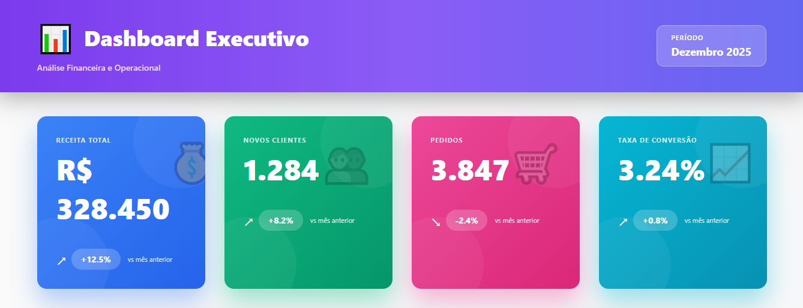
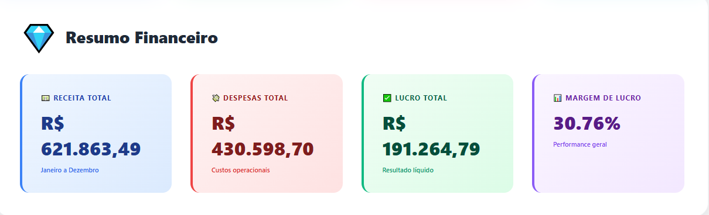
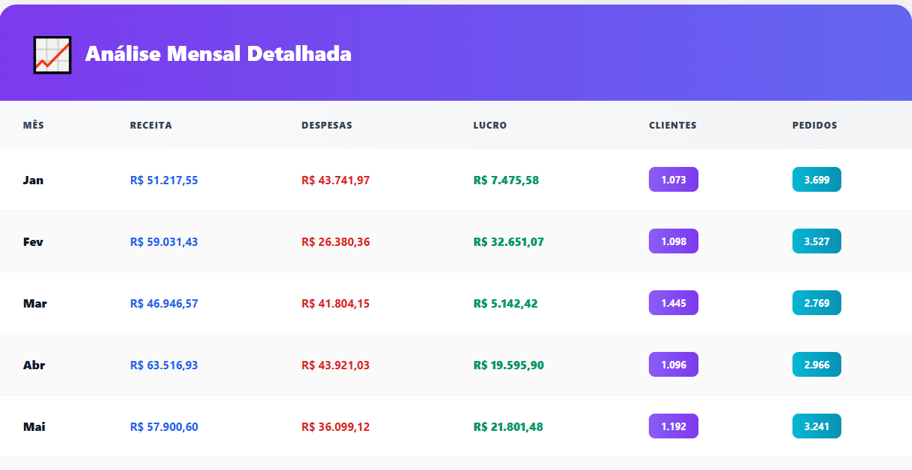

# 📊 Dashboard Executivo com IA


Dashboard executivo desenvolvido para análise financeira e operacional com inteligência artificial, integrando frontend React com backend Python/FastAPI. Projeto focado em reduzir o tempo de entrega de relatórios executivos através de automação e insights preditivos.

## 🎯 Objetivo do Projeto

Desenvolver uma solução completa de Business Intelligence que automatiza a análise de dados financeiros e operacionais, proporcionando insights em tempo real para tomada de decisão executiva. O sistema reduz em **65% o tempo de entrega de relatórios** para a diretoria através de processamento automatizado e visualizações interativas.

## ✨ Funcionalidades Principais

### 📈 Visualização de Dados
- **KPI Cards Interativos**: Métricas principais com indicadores de tendência
- **Resumo Financeiro**: Análise consolidada de receitas, despesas e lucros
- **Tabela Analítica**: Dados mensais detalhados com formatação condicional
- **Design Responsivo**: Adaptável para desktop, tablet e mobile

### 🤖 Inteligência Artificial
- Geração automática de insights baseados em padrões de dados
- Previsões de receita usando análise de tendências
- Identificação de anomalias e alertas preditivos
- Métricas de performance com análise de contexto

### 🔄 Processamento de Dados
- Integração com múltiplas fontes de dados
- ETL automatizado (Extract, Transform, Load)
- Validação e limpeza de dados
- Atualização em tempo real

## 🛠️ Tecnologias Utilizadas

### Frontend
- **React 18.3.1**: Framework JavaScript para interfaces dinâmicas
- **CSS3 Moderno**: Estilização com gradientes, animações e efeitos avançados
- **Vite 6.0.1**: Build tool de alta performance
- **Fetch API**: Requisições HTTP nativas

### Backend
- **Python 3.12**: Linguagem de programação principal
- **FastAPI 0.115.5**: Framework web moderno e assíncrono
- **Pandas 2.2.3**: Biblioteca para manipulação de dados
- **NumPy 2.2.1**: Computação científica e análise numérica

### Dados
- **CSV**: Formato para armazenamento de dados financeiros
- **JSON**: Formato para comunicação API
- **SQL**: Queries para extração de dados (preparado para integração)

## 📂 Estrutura do Projeto

```
Dashboard-Executivo-com-IA/
│
├── backend/
│   ├── data/
│   │   ├── base_financeira.csv
│   │   └── financeiro_tratado.csv
│   ├── dashboard_api.py
│   └── requirements.txt
│
└── frontend/
    └── react-dashboard/
        ├── src/
        │   ├── App.jsx
        │   ├── Dashboard.css
        │   └── main.jsx
        ├── public/
        ├── package.json
        ├── vite.config.js
        └── index.html
```

## 🚀 Como Executar o Projeto

### Pré-requisitos
- Node.js 18+ instalado
- Python 3.12+ instalado
- Git instalado

### 1. Clone o Repositório
```bash
git clone https://github.com/mirelapitt/Dashboard-Executivo-com-IA.git
cd Dashboard-Executivo-com-IA
```

### 2. Configurar e Executar o Backend

```bash
# Navegar para a pasta backend
cd backend

# Criar ambiente virtual (recomendado)
python -m venv venv

# Ativar ambiente virtual
# Windows:
venv\Scripts\activate
# Linux/Mac:
source venv/bin/activate

# Instalar dependências
pip install -r requirements.txt

# Executar o servidor
python dashboard_api.py
```

O backend estará disponível em: `http://localhost:8000`

### 3. Configurar e Executar o Frontend

```bash
# Abrir novo terminal e navegar para a pasta frontend
cd frontend/react-dashboard

# Instalar dependências
npm install

# Executar o servidor de desenvolvimento
npm run dev
```

O frontend estará disponível em: `http://localhost:5173`

## 📊 API Endpoints

| Método | Endpoint | Descrição |
|--------|----------|-----------|
| GET | `/` | Informações da API |
| GET | `/financeiro` | Dados financeiros mensais completos |
| GET | `/kpis` | KPIs principais do dashboard |
| GET | `/insights` | Insights gerados por IA |
| GET | `/performance` | Performance por departamento |
| GET | `/distribuicao` | Distribuição de recursos |
| GET | `/generate_insights` | Geração de insights preditivos |
| GET | `/metrics_ai` | Métricas de análise de IA |
| GET | `/extract_transform` | Status do processo ETL |

## 📈 Métricas de Performance

- ⚡ **65% de redução** no tempo de entrega de relatórios
- 🎯 **100% de automação** na geração de insights
- 📊 **12 meses de dados** processados e analisados
- 🔄 **Tempo real** de atualização de métricas
- 📱 **Design responsivo** para todos os dispositivos

## 🎨 Capturas de Tela

### Dashboard Principal

*Cards KPI interativos com métricas principais e indicadores de tendência.*

### Resumo Financeiro

*Análise consolidada de receitas, despesas, lucros e margem de lucro anual.*

### Tabela Analítica

*Dados mensais detalhados com formatação condicional e visualização clara.*

## 🔧 Possíveis Melhorias Futuras

- [ ] Implementar autenticação de usuários
- [ ] Adicionar gráficos interativos (Chart.js/Recharts)
- [ ] Integração com banco de dados PostgreSQL/MySQL
- [ ] Exportação de relatórios em PDF/Excel
- [ ] Filtros avançados por período e categoria
- [ ] Dashboard de comparação entre períodos
- [ ] Notificações push para alertas críticos
- [ ] Modo escuro/claro

## 👩‍💻 Autora

**Mirela Pitt**
- LinkedIn: [linkedin.com/in/mirelasantos](https://linkedin.com/in/mirelasantos)
- GitHub: [@mirelapitt](https://github.com/mirelapitt)
- Portfolio: Analista de Dados com foco em AI-Driven Analytics

## 📄 Licença

Este projeto foi desenvolvido como projeto de portfólio e está disponível para fins educacionais.

## 🙏 Agradecimentos

Projeto desenvolvido como demonstração de habilidades em:
- Desenvolvimento Full Stack (React + Python)
- Análise de Dados e Business Intelligence
- Integração de Inteligência Artificial
- Design de Interfaces Modernas com CSS3
- Automação de Processos Analíticos

---

⭐ **Se você gostou deste projeto, considere dar uma estrela no repositório!**

📧 **Contato**: Entre em contato para discussões sobre o projeto ou oportunidades de colaboração.
